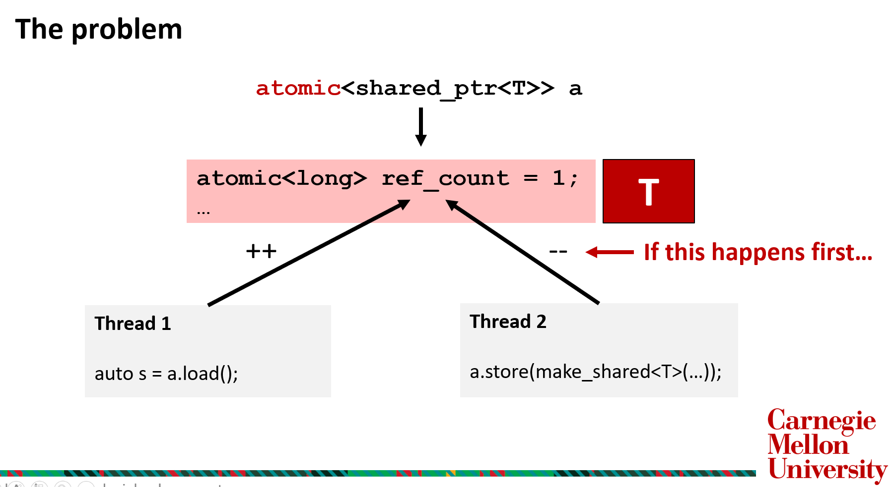
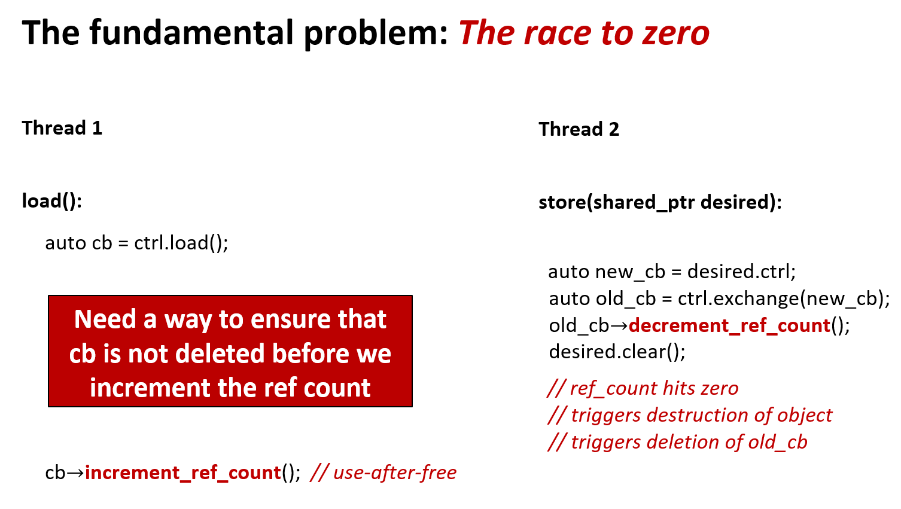

# Lock-Free Data Structures and Atomic std::shared_ptr

## Memory reclamation in lock-free data structures

Once you are done with a node (say popped it from stack) you need to free its heap memory. What if some other node was still accessing it at the moment you free it, it will be left with a dangling reference.

Easy way out : Never free memory of used nodes - No problem if in a garbage collected language but this solution won't work for C++.

How you reclaim memory is crux of the solution. Two common methods are : reference counting (and split reference counting in particular) and deferred reclamation (using hazard pointers, rcu etc)

## ABA Problem

https://lumian2015.github.io/lockFreeProgramming/aba-problem.html

Clearly, one way to avoid this problem is by not freeing memory in use by some other thread (deferred reclamation).

Also, tag field alongside gives a peek into the problem of storing a counter and manipulating it atomically.

## Why shared pointers for lock-free data structures

Because shared pointers provide automatic safe reclamation (no deleting if a reference held by other thread) backed by thread-safe reference counting. Atomic shared pointers would have guaranteed atomicity of concurrent accesses. But what's stopping us is the STL implementation of shared pointers not being lock-free. Let's try to understand this better.

## Thread-safe reference-counting in C++

Well, reference-counting in control block of shared_ptr is guaranteed to be thread-safe. It works great when each thread has its own copy of its shared_ptr.

Since std. library already provides us the RAII compliant shared_ptr it makes sense to use its machinery for our purpose.

Although remember that for std::shared_ptr, updating the managed object from different threads is not thread safe. 

Also updating the same shared_ptr instance (changing what it points to) from different threads is not thread safe. That is, when a single std::shared_ptr instance is shared between threads for concurrent access for writing, problems arise.

e.g : 

```cpp
auto ptr = std::make_shared<widget>();
// Thread 1
auto ptr1 = ptr;
// Thread 2
ptr = ptr2;
// This is undefined behaviour
```

This leads us to atomic shared pointers.

## Atomic Shared Ptr in C++ STL

std::atomic<std::shared_ptr < T >> was introduced in C++20. 

Prior to this, atomic free functions were to be used for atomically accessing shared pointers. They are not lock-free for most data structures not part of std::atomic already. That can be checked by std::atomic_is_lock_free anyway (turns out to be false). Look at an example in *stl_stack_before_cpp20.h* for how conveniently shared_ptr API allows implementing lock-free stack *only if it's lock-free*. (Data can be stored as shared ptrs to provide exception safety while returning in pop as shown in this example.)

But std::atomic<std::shared_ptr < T >> brought the hope of making them lock-free. Look at example in *stl_lock_free_stack_cpp20.h*.  

But any of its current implementations in compilers is **not lock-free** (false on .is_lock_free()).

Why insist on lock-free atomic shared pointers?

Thread-safe concurrent access and memory reclamation is necessary for lock-free data structures. Memory reclamation along with ABA problem is especially tricky to handle. Lock-free atomic shared pointers will encapsulate memory reclamation (RAII) while exposing a simple API.

So no one thought about this earlier?

Many have implemented lock-free atomic shared pointers. We will try understanding techniques used by them and gain knowledge on other aspects of lock-free programming as well.

## Split Reference Counting

Reference counting tackles the problem by storing a count of the number of threads accessing each node.

So we can either choose to implement manual lock-free reference counting solely for our data structure or implement it as part of a new atomic shared_ptr once which can be then used in multiple concurrent structures. Of course we go with the latter.

Lock-free reference counting turns out to be not so easy and involves certain tradeoffs. Let's understand :

**The crux of the problem** :




We wish to update the data and the counter together but no modern CPU supports an atomic instruction to modify two different memory locations simultaneously. This problem will also occur with storing tag in above solution of ABA. This may suggest holding a lock to make the updates. But hey, we can do better.

**Solution 1.** : Store the data and counter adjacent to each other and use Double-Word Compare-and-Swap (DWCAS) instructions available on most modern CPUs. Such instructions can update a double word lock-free.

Tradeoffs : 

- Not all compilers on different platforms have an std::atomic implementation which produces DWCAS instructions. (It would instead use locks in the situation). This hinders portability. One solution is to use boost::atomic.
  
- DWCAS instructions since operate on double the word, take double the time.

**Solution 2.** : Use some bits of the data pointer for counting. If you have 64 bit pointers but virtual addresses are only 48 bits so upper 16 bits are free to be used. AKA Pointer packing. 

But how do you use these solutions for shared_ptr because the ctrl block pointer (to be read from) and the ref_count (inside the ctrl block) are at separate locations? This leads us to Split Reference Count.

**Split Reference Count** :

- Used by Folly (Facebook open-source library, used in production),
- Used by JustThreads (Anthony Williams’ commercial concurrency library). Anthony Williams also has a free, simplified version on GitHub
- Other implementations exist, e.g., a hobby project on GitHub by Vladislav Tyulbashev

**Our key idea** : Introduce a second layer of reference counting local to the atomic shared pointer itself to protect the ref-count in the control block. 


This second ref-cnt and the pointer can together be modified atomically using one of the above two solutions. (Anthony Williams uses first, Folly second)

**A proof of concept implementation in split_ref_cnt.h. Note it is not meant to be used and only for demonstration purposes.**

One thing to highlight is that support for aliasing ctor has been deliberately omitted. This simplifies the shared_ptr struct which can just contain ctrl block ptr and control block will hold pointer to heap object. However, support for aliasing ctor will necessitate storing T* in shared_ptr struct which will complicate this solution.


## Deferred Reclamation

Let's try to understand how deferred reclamation can help our cause. But first let's look at the the common primitive of hazard pointers used for the purpose.

### Hazard Pointers

Like a global bulletin board where each thread has a marker which it uses to mark a node it is going to access and doesn't want to get deleted.

When a thread wishes to delete an object, it must first check the hazard pointers
belonging to the other threads in the system. If none of the hazard pointers reference
the object, it can safely be deleted. Otherwise, it must be left until later. Periodically,
the list of objects that have been left until later is checked to see if any of them can
now be deleted.

Multiple hazard pointer implementations exist. They can be implemented as a global array, linked list etc. They may also become part of C++26.

A look at API of Folly's hazard pointer implementation : 

- hazptr_holder: Class that owns and manages a hazard pointer. Raw hazard pointers are not exposed to users. Instead, each instance of the class hazptr_holder owns and manages at most one hazard pointer.
- protect: Member function of hazptr_holder. Protects an object pointed to by an atomic source (if not null). Safe to access object as long as protected. T* protect(const atomic< T*>& src);
- hazptr_obj_base< T>: Base class for protected objects. Class of objects T will typically derive from hazptr_obj_base< T> (CRTP).
- retire: Member function of hazptr_obj_base that automatically reclaims the object when safe. void retire();

### Deferred reclamation for atomic shared ptrs

Work by Daniel Anderson et al at CMU

What we really need is deferred reclamation for the control block in use which just needs a basic API and internally can be implemented via hazard pointers, RCU or something else.


**Checkout proof of concept implementation via hazard_pointers in hazard_ptr_asp.h modified from [Daniel's code](https://github.com/DanielLiamAnderson/atomic_shared_ptr/blob/master/include/parlay/basic_atomic_shared_ptr.hpp)**

Pros :

- Simpler algorithm (considering hazard pointers an abstraction)
- Daniel's benchmarks suggest equivalent or better throughput compared to Folly's split ref count approach (except low contention case).

Cons :

- Needs external library support (till now) for reclamation
- Also interesting to figure out how tail latency gets affected as we go for amortized or deamortized reclamation (ie cleanup retired nodes once every x no of operations or cleanup after each operation)

---

However if API requirements of atomic< shared_ptr > can be relaxed we can achieve interesting results by introducing a new type itself. 

That takes us into a different territory : [CMU Parlay](https://github.com/cmuparlay/concurrent_deferred_rc) and [Daniel's Video](https://www.youtube.com/watch?v=OS7Asaa6zmY). Let's keep that for some other day. Beautiful work being done by great people.

A brief glimpse : 

It tries to take the deferred reclamation idea and combine with a RAII shared-ownership type. It aims to use deferred reclamation to defer decrements to ref_cnt of atomic shared ptr. ie :

    protect (x) : Prevent ref count of x from being decremented

    retire (x) : Decrement ref count of x when it's not protected

And internally hazard pointers, RCU etc can be used to implement protect or retire. Also we add a get_snapshot() method allowing us to read by eliding ref count increments.

And why it excites us is due to the fact that std::atomic< shared_ptr > (even if lock-free) would behave much worse than manual memory reclamation techniques on *read-heavy workloads* particulary and also on other workloads. But by loosening standard API restrictions of how an atomic shared ptr needs to behave, we can combine best of both worlds and achieve much better performance along with the simple interface of atomic shared ptrs, as demonstrated by Daniel in his talk.

---