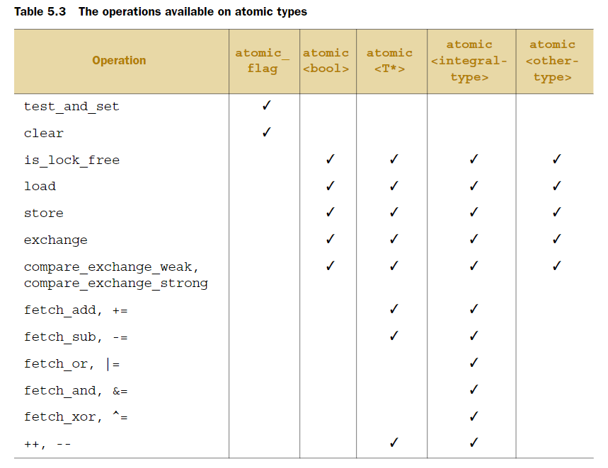
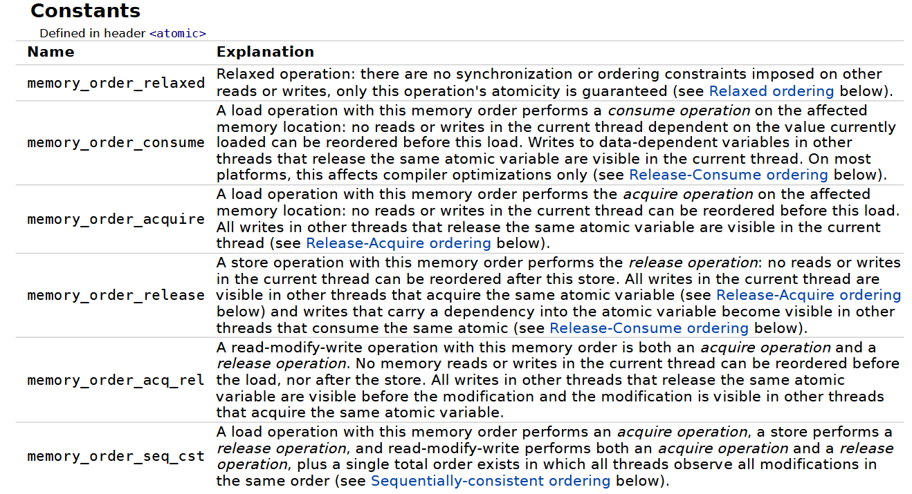

# C++ Memory Model and atomic types

## Intro

**Lock-free vs wait-free**

If a program is lock-free, it basically means that at least one of its threads is guaranteed to make progress over an arbitrary period of time. If a program deadlocks, none of its threads (and therefore the program as a whole) cannot make progress - we can say it's not lock-free. Since lock-free programs are guaranteed to make progress, they are guaranteed to complete (assuming finite execution without exceptions).

*A spinlock is nonblocking but not lock-free.*

Wait-free is a stronger condition which means that every thread is guaranteed to make progress in a bounded amount of time. No starvation essentially. Threads need to collaborate to allow each other to complete their operations. DUe to this algorithm is likely to be more complex.

All wait-free programs are lock-free.

**std::atomic**

Each instantiation and full specialization of the std::atomic template defines an atomic type. If one thread writes to an atomic object while another thread reads from it, the behavior is well-defined (see memory model for details on data races).

In addition, accesses to atomic objects may establish inter-thread synchronization and order non-atomic memory accesses as specified by std::memory_order.

std::atomic is neither copyable nor movable.

- Every variable is an object, including those that are members of other objects.
- Every object occupies at least one memory location. 
- Variables of fundamental type such as  int or char are exactly one memory location, whatever their size, even if they're adjacent or part of an array.
- Adjacent bit fields are part of the same memory location.

If  two  threads  access  separate  memory  locations, 
there's no problem: everything works fine. On the other hand, if two threads access
the same memory location, then you have to be careful. 

If neither thread is updating the
memory location, you're fine; read-only data doesn't need protection or synchroniza-
tion. If either thread is modifying the data, there's a potential for a race condition. In  order  to  avoid  the  race  condition,  there  has  to  be  an  enforced  ordering 
between the accesses in the two threads.

**If there's no enforced ordering between two accesses to a single memory location
from separate threads, one or both of those accesses is not atomic, and one or both is
a write, then this is a data race and causes undefined behavior.**

In other words : **If one evaluation modifies a memory location, and the other reads or modifies the same memory location, and if at least one of the evaluations is not an atomic operation, the behavior of the program is undefined (the program has a data race) unless there exists a happens-before relationship between these two evaluations.**

## C++ atomic types

The  standard  atomic  types  (almost)  all  have  an  is_lock_free()  member  function,  which  allows  the 
user to determine whether operations on a given type are done directly with atomic
instructions (x.is_lock_free() returns true) or done by using a lock internal to the
compiler and library (x.is_lock_free() returns false).

The only type that doesn't provide an is_lock_free() member function is 
std::atomic_flag. This type is a really simple Boolean flag, and operations on this type
are  required to be lock-free.

The  remaining  atomic  types  are  all  accessed  through  specializations  of  the 
std::atomic<>  class  template  but  may  not  be  lock- 
free. 

std::atomic is neither copyable nor movable. All  operations 
on  an  atomic  type  are  defined  as  atomic,  and  assignment  and  copy-construction
involve two objects. A single operation on two distinct objects can't be atomic. In the
case  of  copy-construction  or  copy-assignment,  the  value  must  first  be  read  from  one
object and then written to the other. These are two separate operations on two sepa-
rate  objects,  and  the  combination  can't  be  atomic.  Therefore,  these  operations
aren't permitted.

**Important**

`std::atomic<T>::operator=` :

1) `T operator=(T desired)` : Can assign non-atomic type values to atomic variable. Unlike most assignment operators, the assignment operators for atomic types do not return a reference to their left-hand arguments. They return a copy of the stored value (desired) instead.

Because otherwise, in order to get the stored value from such a reference, the code would have to perform a
separate read, thus allowing another thread to modify the value between the assign-
ment and the read and opening the door for a race condition.

2) `atomic& operator=(const atomic&)`: No copy assignment

`std::atomic<T>:: ctor`:

1) Default ctor
2) Not copy ctor
3) atomic (T desired) - Initializes the underlying object with desired. The initialization is not atomic. Initialization with non-atomic type allowed.

---

The
compare/exchange operation is the cornerstone of programming with atomic types;
it compares the value of the atomic variable with a supplied expected value and stores
the  supplied  desired  value  if  they're  equal.  If  the  values  aren't  equal,  the  expected
value is updated with the actual value of the atomic variable. The return type of the
compare/exchange functions is a bool, which is true if the store was performed and
false otherwise. 

For compare_exchange_weak(), the store might not be successful even if the origi-
nal  value  was  equal  to  the  expected  value,  in  which  case  the  value  of  the  variable  is
unchanged and the return value of compare_exchange_weak() is false. This is most
likely to happen on machines that lack a single compare-and-exchange instruction, if
the processor can't guarantee that the operation has been done atomically—possibly
because the thread performing the operation was switched out in the middle of the
necessary  sequence  of  instructions.  This  is  called  a
spurious failure, because the reason for the failure is a function of timing rather than
the values of the variables.

Because compare_exchange_weak() can fail spuriously, it must typically be used in
a loop:

```cpp
bool expected=false;
extern atomic<bool> b; // set somewhere else
while(!b.compare_exchange_weak(expected,true) && !expected);
```
In  this  case,  you  keep  looping  as  long  as  expected  is  still  false,  indicating  that  the
compare_exchange_weak() call failed spuriously.

On  the  other  hand,  compare_exchange_strong()  is  guaranteed  to  return  false
only  if  the  actual  value  wasn't  equal  to  the  expected  value.  This  can  eliminate  the 
need for loops. 

The compare/exchange functions are also unusual in that they can take two memory-
ordering parameters. This allows for the memory-ordering semantics to differ in the
case  of  success  and  failure;  it  might  be  desirable  for  a  successful  call  to  have
memory_order_acq_rel  semantics  whereas  a  failed  call  has  memory_order_relaxed
semantics.  A  failed  compare/exchange  doesn't  do  a  store,  so  it  can't  have  memory_
order_release  or  memory_order_acq_rel  semantics.  It's  therefore  not  permitted  to
supply these values as the ordering for failure. You also can't supply stricter memory
ordering for failure than for success; if you want memory_order_acquire or memory_
order_seq_cst semantics for failure, you must specify those for success as well.

If you don't specify an ordering for failure, it's assumed to be the same as that for
success,  except  that  the  release  part  of  the  ordering  is  stripped:  memory_order_
release becomes memory_order_relaxed, and memory_order_acq_rel becomes 
memory_order_acquire. If you specify neither, they default to memory_order_seq_cst
as usual, which provides the full sequential ordering for both success and failure.

---

Operator (+= or -=) vs methods (fetch_add or fetch_sub) : 

Methods return old value; Allow specifying memory order.

Operators return new value; Specifying  the  ordering  semantics  isn't  possible  for  the  operator  forms,  because
there's  no  way  of  providing  the  information:  these  forms  therefore  always  have
memory_order_seq_cst semantics.

The set of compound-assignment operations on atomic integral types is not quite
the  full  set  of  compound-assignment  operations  you  could  do  on  a  normal  integral
type, but it's close enough: only division, multiplication, and shift operators are miss-
ing. Additional operations can easily be done using
compare_exchange_weak() in a loop, if required.



---

## Memory Ordering

For reference : *https://en.cppreference.com/w/cpp/atomic/memory_order*

There are six memory ordering options that can be applied to operations on atomic
types: memory_order_relaxed, memory_order_consume, memory_order_acquire,
memory_order_release, memory_order_acq_rel, and memory_order_seq_cst. Unless
you specify otherwise for a particular operation, the memory-ordering option for all
operations on atomic types is  memory_order_seq_cst, which is the most stringent of
the  available  options.  Although  there  are  six  ordering  options,  they  represent  three
models:  sequentially  consistent  ordering  ( memory_order_seq_cst),  acquire-release  order -
ing  (memory_order_consume,  memory_order_acquire,  memory_order_release,  and
memory_order_acq_rel), and relaxed ordering (memory_order_relaxed).

The  availability  of  the  distinct  memory-ordering  models  allows  experts  to  take 
advantage of the increased performance of the more fine-grained ordering relation-
ships  where  they’re  advantageous  while  allowing  the  use  of  the  default  sequentially-
consistent ordering (which is considerably easier to reason about than the others) for
those cases that are less critical. Also explicitly mentioning choice of ordering makes program more readable. Memory order specification is important to express why the 
atomic operations are used and what the programmer 
wanted to happen.

For any ordering other than sequentially consistent, even if the threads
are  running  the  same  bit  of  code,  they  can  disagree  on  the  order  of  events  because  of
operations in other threads in the absence of explicit ordering constraints, because the
different CPU caches and internal buffers can hold different values for the same memory.
It’s so important I’ll say it again: threads don’t have to agree on the order of events.



### Relaxed Ordering :

All threads agree on the order of operations on every particular atomic variable. But it's the case only for individual variables. If other variables (atomic or not) are involved, threads might disagree on how exactly the operations on different variables are interleaved.

Typical use for relaxed memory ordering is incrementing counters, such as the reference counters of std::shared_ptr, since this only requires atomicity, but not ordering or synchronization. Note that decrementing the std::shared_ptr counters requires acquire-release synchronization with the destructor. Here's why: 

Imagine that thread 1 reads/writes to *ptr, then destroys its copy of ptr, decrementing the ref count. Then thread 2 destroys the last remaining pointer, also decrementing the ref count, and then runs the destructor.

Since the destructor in thread 2 is going to access the memory previously accessed by thread 1, the acq_rel synchronization is necessary. Otherwise you'd have a data race and UB.

I strongly recommend avoiding relaxed
atomic operations unless they’re absolutely necessary and even then using them only
with extreme caution.

### Release-Acquire ordering :

If an atomic store in thread A is tagged memory_order_release, an atomic load in thread B from the same variable is tagged memory_order_acquire, and the load in thread B reads a value written by the store in thread A, then the store in thread A synchronizes-with the load in thread B.

All memory writes (including non-atomic and relaxed atomic) that happened-before the atomic store from the point of view of thread A, become visible side-effects in thread B. That is, once the atomic load is completed, thread B is guaranteed to see everything thread A wrote to memory.

There's a special rule that synchronization propagates across any number of read-modify-write operations regardless of their memory order. E.g. if thread 1 does a.store(1, release);, then thread 2 does a.fetch_add(2, relaxed);, then thread 3 does a.load(acquire), then thread 1 successfully synchronizes with thread 3, even though there's a relaxed operation in the middle.

If read-modify-write operations are involved, nothing stops you from synchronizing with more than one operation. In the example above, if fetch_add was using acquire or acq_rel, thread 1 would additionally synchronize with it, and conversely, if it used release or acq_rel, it would additonally syncrhonize with thread 3.

The synchronization is established only between the threads releasing and acquiring the same atomic variable. Other threads can see different order of memory accesses than either or both of the synchronized threads.

On strongly-ordered systems like **x86** — release-acquire ordering is automatic for the majority of operations. No additional CPU instructions are issued for this synchronization mode; only certain compiler optimizations are affected (e.g., the compiler is prohibited from moving non-atomic stores past the atomic store-release or performing non-atomic loads earlier than the atomic load-acquire). On weakly-ordered systems (ARM, Itanium, PowerPC), special CPU load or memory fence instructions are used.

**Mutual exclusion locks, such as std::mutex or atomic spinlock, are an example of release-acquire synchronization: when the lock is released by thread A and acquired by thread B, everything that took place in the critical section (before the release) in the context of thread A has to be visible to thread B (after the acquire) which is executing the same critical section.**

### Sequentially Consistent Ordering :

Atomic operations tagged memory_order_seq_cst not only order memory the same way as release/acquire ordering (everything that happened-before a store in one thread becomes a visible side effect in the thread that did a load), but also establish a single total modification order of all atomic operations that are so tagged and the same is seen by **all threads**.

Note that:

1) as soon as atomic operations that are not tagged memory_order_seq_cst enter the picture, the sequential consistency guarantee for the program is lost,
2) in many cases, memory_order_seq_cst atomic operations are reorderable with respect to other atomic operations performed by the same thread.

Sequential ordering may be necessary for multiple producer-multiple consumer situations where all consumers must observe the actions of all producers occurring in the same order.

Total sequential ordering requires a full memory fence CPU instruction on all multi-core systems. This **may** become a performance bottleneck since it forces the affected memory accesses to propagate to every core.

---

Although most of the synchronization relationships come from the memory-ordering semantics applied to operations on atomic variables, it’s also possible to introduce
additional ordering constraints by using fences (memory barriers).

This is the general idea with fences: if an acquire operation sees the result of
a store that takes place after a release fence, the fence synchronizes-with that acquire
operation; and if a load that takes place before an acquire fence sees the result of a
release  operation,  the  release  operation  synchronizes-with  the  acquire  fence.

Of
course, you can have fences on both sides, if a
load that takes place before the acquire fence sees a value written by a store that takes
place after the release fence, the release fence synchronizes-with the acquire fence.

---